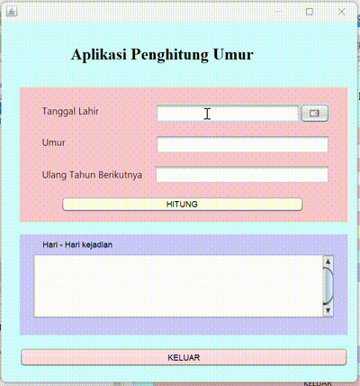

# AplikasiPenghitungUmur
Latihan 2 - Siti Aisyah Nor Fitriani (2210010043)

# Aplikasi Penghitung Umur

**Aplikasi Penghitung Umur** adalah aplikasi berbasis Java yang membantu pengguna menghitung usia secara rinci, menampilkan tanggal ulang tahun berikutnya, serta menyajikan informasi tentang peristiwa penting yang terjadi pada tanggal tersebut.

## Keunggulan Aplikasi

- **Menghitung Usia:** Menghitung usia pengguna berdasarkan tanggal lahir yang diinput.
- **Tanggal Ulang Tahun Berikutnya:** Menampilkan tanggal ulang tahun berikutnya beserta hari dalam bahasa Indonesia.
- **Peristiwa Penting:** Menyediakan informasi historis tentang peristiwa penting pada tanggal ulang tahun berikutnya yang diambil secara daring.

## Pembuat Aplikasi
- **Nama:** Siti Aisyah Nor Fitriani  
- **NIM:** 22100100430  
- **Latihan:** Latihan 2

## Fitur Utama

1. **Penghitungan Umur Rinci**  
   Menghitung usia dalam format lengkap (tahun, bulan, hari) berdasarkan tanggal lahir yang dimasukkan pengguna.

2. **Tanggal Ulang Tahun Berikutnya**  
   Menampilkan tanggal ulang tahun pengguna berikutnya, termasuk hari dalam bahasa Indonesia.

3. **Peristiwa Penting pada Tanggal Ulang Tahun Berikutnya**  
   Menyediakan informasi historis dari API eksternal tentang peristiwa yang terjadi pada tanggal tersebut, memberikan wawasan unik kepada pengguna.

4. **Antarmuka Pengguna yang Sederhana**  
   Aplikasi dibangun menggunakan Java Swing, memberikan antarmuka yang mudah digunakan dengan input sederhana.

5. **Pembatalan Pengambilan Data Asinkron**  
   Menyediakan opsi pembatalan untuk proses pengambilan data peristiwa penting.

6. **Format Tanggal yang Mudah Dipahami**  
   Tanggal ulang tahun berikutnya ditampilkan dalam format **dd-MM-yyyy**, sesuai standar di Indonesia.

## Cara Menjalankan

1. Clone atau unduh repositori sebagai file ZIP.
2. Buka proyek di IDE pilihan Anda.
3. Pastikan JDK sudah dikonfigurasi di IDE.
4. Jalankan **PenghitungUmurFrame** untuk memulai aplikasi.

## Demo

---

**Catatan:** Untuk fitur **Peristiwa Penting**, pastikan koneksi internet aktif karena aplikasi mengambil data dari API eksternal.
